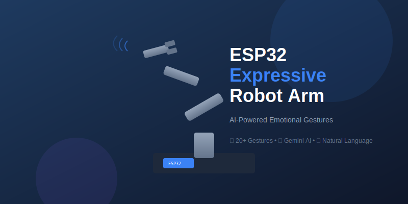

# ESP32 Expressive Robot Arm 🤖✨

[](https://www.python.org/downloads/)
[](https://micropython.org/)
[](https://ai.google.dev/)
[](https://opensource.org/licenses/MIT)

> **Give your robot arm emotions and personality with AI-powered expressive gestures**

Transform a simple $40 robot arm into an **expressive companion** that waves, salutes, dances, shows emotions, and responds to natural language commands using Google's Gemini AI.

<p align="center">
  
</p>

---

## What Makes This Different

| Traditional Robot Arms | This Expressive Arm |
|------------------------|---------------------|
| Moves point to point | Moves with **emotion and personality** |
| Programmed sequences | **Natural language** commands |
| Mechanical feeling | **Smooth, human-like** motion |
| Single purpose | **20+ expressive gestures** |

<p align="center">
  
</p>

---

## Demo

```bash
# Tell it what to express in plain English
python expressive/gemini_expressive.py "Wave hello enthusiastically"

# It understands context and emotions
python expressive/gemini_expressive.py "Show that you're thinking hard"

# Chain multiple expressions
python expressive/gemini_expressive.py "React surprised, then celebrate"
```

**Example Session:**
```
You: "Greet my friend who just arrived"

Interpretation: Friendly greeting - warm and welcoming
Gestures: [wave_friendly]

Executing on /dev/cu.usbserial-110...
Gesture: wave_friendly (Friendly wave to greet someone)
=== Sequence complete! ===
```

---

## Hardware Requirements

### Robot Arm Kit ($40-60)

**Recommended:** [SIYEENOVE Smart Robot Arm for ESP32-C3](https://www.amazon.com/SIYEENOVE-Building-Joystick-Children-Educational/dp/B0DKWJ14WW)

| What's Included | Notes |
|-----------------|-------|
| ESP32-C3 microcontroller | Pre-programmed, WiFi capable |
| 4x MG90S servo motors | Base, shoulder, elbow, gripper |
| 4-DOF acrylic arm structure | Easy 2-3 hour assembly |
| Dual joystick controller | For manual control |
| Gripper/claw mechanism | Pick up light objects |
| All cables and hardware | Complete kit |

**Alternative Options:**
- [ACEBOTT 4 DOF ESP32 Robotic Arm](https://www.amazon.com/ACEBOTT-Programmable-Compatible-Educational-Teenagers/dp/B0DGTH4N43)
- [KEYESTUDIO Robot Arm Starter Kit](https://www.amazon.com/KEYESTUDIO-Arduino-Electronic-Robotics-Bluetooth/dp/B08B8GJSH9)

**You'll Also Need:**
- USB-C data cable (not charge-only)
- 2x 18650 batteries OR 5V power supply
- Computer with Python 3.8+
- [Gemini API key](https://aistudio.google.com/app/apikey) (free)

<p align="center">
  
</p>

---

## Quick Start

### 1. Clone & Setup

```bash
git clone https://github.com/goker/esp32-expressive-arm.git
cd esp32-expressive-arm

# Create virtual environment
python3 -m venv .venv
source .venv/bin/activate

# Install dependencies
pip install -r requirements.txt

# Flash MicroPython firmware (first time only)
bash setup.sh
```

### 2. Get Your Gemini API Key

1. Visit [Google AI Studio](https://aistudio.google.com/app/apikey)
2. Click "Create API Key" (free tier available)
3. Set it in your terminal:

```bash
export GEMINI_API_KEY="your-api-key-here"
```

### 3. Connect & Test

```bash
# Verify connection
python smoketest.py

# Test servos
python demos/01_test_servos.py
```

### 4. Start Expressing!

```bash
# Interactive mode - have a conversation
python expressive/gemini_expressive.py

# Single command
python expressive/gemini_expressive.py "Do a victory dance"
```

---

## Available Gestures

### Greetings & Social

| Gesture | Command | Description |
|---------|---------|-------------|
| `wave_friendly` | "Wave hello" | Friendly wave greeting |
| `wave_excited` | "Wave enthusiastically" | Excited, energetic wave |
| `salute` | "Salute" | Respectful military salute |
| `bow` | "Take a bow" | Formal bow |
| `beckoning` | "Come here gesture" | Inviting motion |

### Emotional Expressions

| Gesture | Emotion | Description |
|---------|---------|-------------|
| `excited_bounce` | Happy | Bouncing up and down |
| `celebrate` | Joy | Victory arm pump |
| `sad_droop` | Sad | Drooping posture |
| `surprised` | Surprise | Startled reaction |
| `angry_shake` | Anger | Fist shaking |
| `shy_retreat` | Shy | Retreating motion |
| `curious_look` | Curious | Examining something |
| `tired_stretch` | Tired | Stretching motion |

### Communication

| Gesture | Meaning | Description |
|---------|---------|-------------|
| `nod_yes` | Yes | Nodding agreement |
| `shake_no` | No | Shaking disagreement |
| `shrug` | Uncertain | "I don't know" |
| `point_forward` | Look there | Pointing gesture |
| `thinking` | Contemplating | Thoughtful pose |

### Fun

| Gesture | Description |
|---------|-------------|
| `dance_groove` | Fun dancing motion |

<p align="center">
  
</p>

---

## How It Works

```
┌────────────────────────────────────────────────────────┐
│  "Wave hello and show you're happy"                    │
└───────────────────────┬────────────────────────────────┘
                        │
                        ▼
┌────────────────────────────────────────────────────────┐
│                   GEMINI AI                            │
│  • Understands natural language intent                 │
│  • Detects emotional context                           │
│  • Selects appropriate gestures                        │
│  • Adjusts speed/intensity for emotion                 │
└───────────────────────┬────────────────────────────────┘
                        │
                        ▼
┌────────────────────────────────────────────────────────┐
│              GESTURE LIBRARY                           │
│  • 20+ parameterized emotional gestures                │
│  • Keyframe-based motion sequences                     │
│  • Speed and amplitude modulation                      │
└───────────────────────┬────────────────────────────────┘
                        │
                        ▼
┌────────────────────────────────────────────────────────┐
│             MOTION GENERATOR                           │
│  • Minimum jerk trajectories (smooth motion)           │
│  • Exponential smoothing (no jitter)                   │
│  • 50Hz real-time control                              │
└───────────────────────┬────────────────────────────────┘
                        │
                        ▼
┌────────────────────────────────────────────────────────┐
│           ESP32-C3 + SERVOS                            │
│  • MicroPython real-time execution                     │
│  • PWM servo control on GPIO 4,5,6,7                   │
│  • Auto-detach safety (10s timeout)                    │
└────────────────────────────────────────────────────────┘
```

---

## Project Structure

```
esp32-expressive-arm/
│
├── expressive/                    # AI-POWERED EXPRESSION SYSTEM
│   ├── gestures.py               # 20+ emotional gesture definitions
│   ├── gemini_expressive.py      # Natural language → gestures
│   └── __init__.py
│
├── demos/                         # Example movement patterns
│   ├── utils.py                  # Shared MicroPython code
│   ├── 01_test_servos.py         # Basic servo test
│   ├── 05_wave_motion.py         # Wave demo
│   └── ...                       # AI-generated demos
│
├── chicken/                       # Workflow & calibration system
│   ├── calibrator_web.py         # Web-based servo calibration
│   ├── workflow_designer.py      # Create motion sequences
│   └── chicken.py                # Execute JSON workflows
│
├── ai/                           # Original Gemini integration
│   └── AGENT_INSTRUCTIONS.md     # AI agent prompts
│
├── robot-arm-rust/               # Rust CLI (experimental)
│   └── src/main.rs               # Voice + Gemini control
│
├── assets/                       # Images and media
├── setup.sh                      # One-click firmware flash
├── smoketest.py                  # Connection test
└── requirements.txt              # Python dependencies
```

---

## Advanced Usage

### Interactive Conversation Mode

```bash
python expressive/gemini_expressive.py
```

```
Expressive Robot Arm - Interactive Mode

Tell me what to express! Examples:
  - 'Wave hello to everyone'
  - 'Show that you're thinking hard'
  - 'React surprised then happy'
  - 'Do a little dance'

Type 'quit' to exit, 'list' to see gestures

You: show me all the emotions you can express
```

### Programmatic Control

```python
from expressive.gemini_expressive import express
from expressive.gestures import get_gesture

# AI-interpreted expression
result = express("Show curiosity about something on the table")
print(result['interpretation'])
print(result['gestures'])

# Direct gesture control
wave = get_gesture("wave_friendly", speed=1.5, amplitude=1.2)
```

### Create Custom Gestures

```python
from expressive.gestures import Gesture, Keyframe, Emotion

def my_custom_wave():
    return Gesture(
        name="custom_wave",
        description="My personalized wave",
        keyframes=[
            Keyframe(base=90, shoulder=60, elbow=45, gripper=30, duration=0.4),
            Keyframe(base=120, shoulder=60, elbow=45, gripper=30, duration=0.2),
            Keyframe(base=60, shoulder=60, elbow=45, gripper=30, duration=0.2),
            # Add more keyframes...
        ],
        emotion=Emotion.HAPPY,
        speed_multiplier=1.0,
        loops=2
    )
```

### Web Calibration Tool

```bash
cd chicken
python calibrator_web.py
# Open http://localhost:3001
```

---

## Use Cases

| Application | Description |
|-------------|-------------|
| **Desk Companion** | Robot that reacts to your mood and greets visitors |
| **Educational** | Teach robotics, AI, and programming concepts |
| **Interactive Art** | Installations that respond to audiences |
| **Content Creation** | Animated reactions for streams and videos |
| **Accessibility** | Non-verbal communication assistance |
| **Research** | Human-robot interaction studies |
| **Prototyping** | Test expressive behaviors before full-scale builds |

---

## Motion Technology

### Minimum Jerk Trajectory
Smooth, human-like motion using quintic polynomial:
```
s(t) = 10t³ - 15t⁴ + 6t⁵
```

### Exponential Smoothing
Reduces servo jitter for fluid movement:
```
smooth_pos = old_pos × 0.5 + new_pos × 0.5
```

### Safety Features
- Auto-detach servos after 10 seconds of inactivity
- Smooth emergency stop returns to safe position
- Configurable joint limits prevent damage

---

## Troubleshooting

| Problem | Solution |
|---------|----------|
| No USB device found | Try different cable/port, check `ls /dev/cu.usb*` |
| Servos don't move | Check 5V power supply, verify GPIO wiring |
| Gemini API error | Verify API key is set: `echo $GEMINI_API_KEY` |
| Jerky motion | Increase SPEED_MULTIPLIER in servo_utils.py |

**Factory Reset:**
```bash
bash wipe.sh      # Erase everything
bash setup.sh     # Reflash MicroPython
```

---

## Contributing

Contributions welcome! Ideas:

- [ ] Add more gesture definitions
- [ ] Improve emotion detection prompts
- [ ] Add voice input support
- [ ] Create web interface for gestures
- [ ] Camera input for reactive behaviors
- [ ] Support Claude, GPT-4, Llama models

---

## Credits

- Original servo-poc by [@jorgeajimenez](https://github.com/jorgeajimenez/servo-poc)
- Expressive gesture system by [@goker](https://github.com/goker)
- Powered by [Google Gemini AI](https://ai.google.dev/)

---

## License

MIT License - Use freely for any project!

---

## Keywords

`robot arm` `ESP32` `ESP32-C3` `expressive robotics` `emotional AI` `Gemini AI` `MicroPython` `robot gestures` `human-robot interaction` `DIY robotics` `servo control` `natural language robot` `AI robot` `robot emotions` `physical AI` `embodied AI` `robot companion` `interactive robot` `STEM education` `maker project` `low-cost robot` `robot arm kit` `gesture control` `emotional expression` `robot personality`

---

<p align="center">
  <b>Built for expressive robotics</b>
  <br><br>
  <a href="https://github.com/goker/esp32-expressive-arm/stargazers">Star this repo</a> if you find it useful!
</p>
